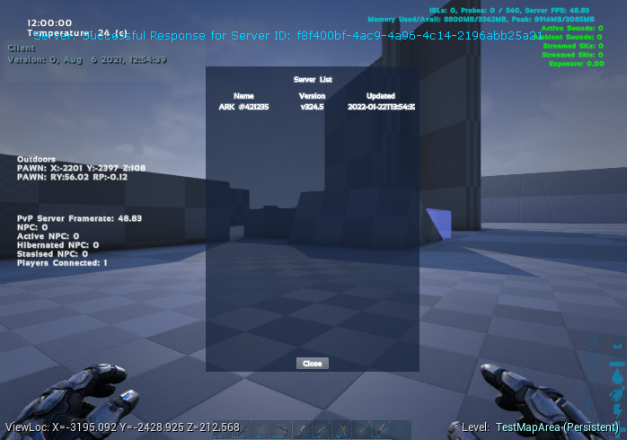
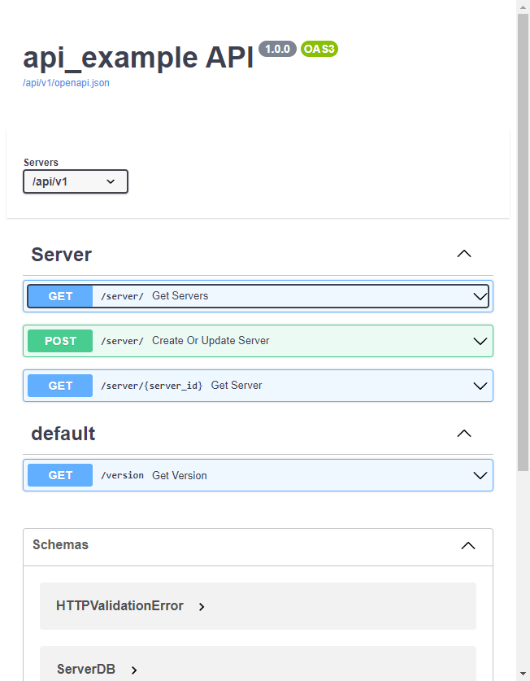
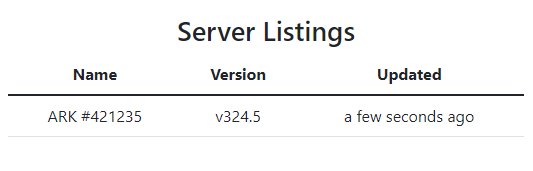

# ARK API Example Mod and Server
This repository servers as a template for learning or starting an ARK: Survival Evolved mod 
that integrates with an API. The example API, serves as a simple server listings site. Mod 
assets are included as well.

**Features**:
* FastAPI for API Backend with SQLAlchemy ORM and Postgres database
* VueJS 3 Frontend with Bootstrap 5
* Dockerized

## What's Included
### Mod

Copy the `APIExample` folder into `ARKEditor/Projects/ShooterGame/Content/Mods`, and load ADK.

#### CCA_APIExample
Singleton asset that checks into API with Server Session Name and Version. Also adds `Buff_APIExample` 
to every ShooterCharacter on spawn. 

#### Buff_APIExample
Buff to act as a replication controller and Widget manager. This buff makes calls to the API to 
get the server list in game.

#### Widget_APIExample
Widget that shows a simple Server List from API Response. Open UI with `Shift+End`.

### Backend (app)

Factory structured FastAPI application. Modularized and fairly self-explanatory with a little 
education from [FastAPI](https://fastapi.tiangolo.com/). SwaggerUI is accessible @ `/api/v1/`. 
Ex: `http://localhost/api/v1/`

### Frontend

VueJS 3 app powered with NodeJS. Makes simple calls to API Backend and displays a list of Servers.

## How to Use
Install Docker (Linux) or Docker Desktop (Windows, MacOS), and start the application in the following 
ways

Development/Testing:

    docker-compose up 

Production:

    docker-compose -f docker-compose.yml -f docker-compose.prod.yml up

### Database Migrations
SQLAlchemy and Alembic are preconfigured within this project to allow you to autogenerate 
migrations. Migrations allow the code to define the schema, and then programmatically keep
the database in sync with the applications. Anytime you make a schema change to `app/database/models.py`,
you will need to generate a migration.

#### Generating Database Migrations
Gain a shell to the api container once it is up and running, either through Docker Desktop or 
`docker exec` command. Run the following command to generate a migration file, which can be 
located at `migrations/versions`.

    alembic revision -m "My Revision Change Message" --autogenerate

The migration will be applied on next container start, or you can manually apply it from within 
the container using the following command.

    alembic upgrade head

## Production Build Notes
The production built image will build the VueJS application, copy it over, and be served by FastAPI.

## Additional Information
### Contributing
This README is fairly slim, and could use some additional information explaining the structure 
between the backend and frontend. This is a time-consuming task that may or may not get completed 
in the future. 

### Getting Help

Documentation Links:
* [VueJS](https://v3.vuejs.org/)
* [Bootstrap](https://getbootstrap.com)
* [FastAPI](https://fastapi.tiangolo.com/)
* [SQLAlchemy](https://www.sqlalchemy.org/)

#### ARK Modding Discord
If you own ARK: Survival Evolved and are ready to start modding, feel free to 
[join the Discord](https://discord.arkmodding.net). You may also feel free to `@jslay` if you need
help with this project.
